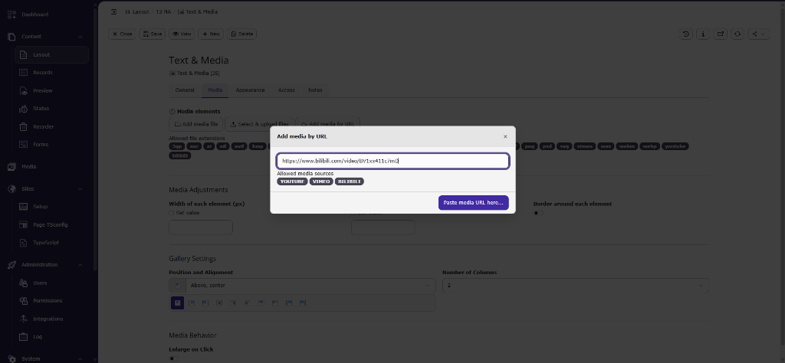
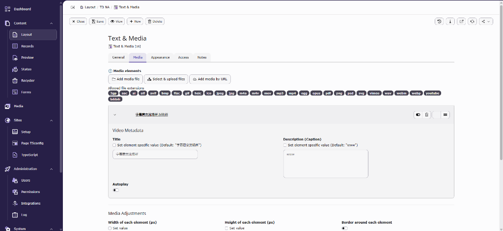
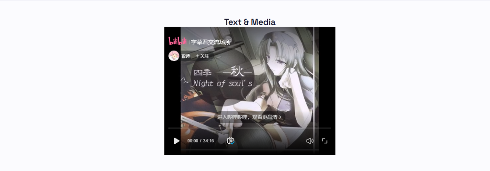

# TYPO3 Extension `bilibili_media`

[](https://typo3.org)
[](https://typo3.org)
[](https://typo3.org)
[](https://php.net)
[](LICENSE)

Seamless, enterprise-ready **Bilibili Video Integration** for **TYPO3 CMS** (v12, v13, and v14). Enables pasting Bilibili video URLs directly into TYPO3's standard **Add media by URL** dialog for both **Text & Media** (`textmedia`) and **Media** (`media`) content elements.

---

## Key Features

- **Native Online Media Provider**: Integrates directly with TYPO3 FAL (File Abstraction Layer) as a core Online Media Provider, just like YouTube and Vimeo.
- **Supports Text & Media and Media Elements**: Works seamlessly with `textmedia` (`assets`) and `media` (`assets` / `media`) content elements.
- **Automatic Thumbnail & Metadata Extraction**: Automatically fetches high-resolution cover images from Bilibili's API, saving them to FAL storage, and extracts title, width, and height.
- **Privacy & Content Security Policy (CSP)**: Ships with CSP mutations (`Configuration/ContentSecurityPolicies.php`) for TYPO3 Frontend and Backend (`*.bilibili.com`, `player.bilibili.com`, `*.hdslb.com`, `*.bilivideo.com`, `*.bilivideo.cn`).
- **Responsive Iframe Player**: Renders clean, responsive HTML5 player iframes with optimized parameters (`high_quality=1`, `page=1`, `referrerpolicy="strict-origin-when-cross-origin"`).
- **Backend Branding & Icons**: Custom SVG MIME type icon (`video/bilibili`) for Backend Filelist and Form Engine.
- **TYPO3 v12, v13, & v14 Ready**: Fully compliant with PHP 8.1 - 8.4 and TYPO3 v12.4 LTS, v13.4 LTS, and v14.x.

---

## Screenshots

### 1. Backend: Add Bilibili Media by URL


### 2. Backend: FAL File Record with Metadata & Thumbnail


### 3. Frontend: Responsive Bilibili Video Player Rendering


---

## Supported URL Formats

The extension automatically processes and extracts video IDs (`BV` and legacy `AV` formats) from any of the following URLs:

- **Standard Video URL**: `https://www.bilibili.com/video/BV1xx411c7mD`
- **URL with Query Parameters**: `https://www.bilibili.com/video/BV1xx411c7mD?p=1`
- **Shortened Share Links**: `https://b23.tv/BV1xx411c7mD`
- **Direct Player Embed URLs**: `https://player.bilibili.com/player.html?bvid=BV1xx411c7mD`
- **Legacy AV URLs**: `https://www.bilibili.com/video/av12345678`
- **HTML Iframe Snippets**: `<iframe>` snippets containing valid Bilibili video URLs.

---

## Requirements

| Component | Supported Versions |
| :--- | :--- |
| **TYPO3 CMS** | `^12.4.0` \| `^13.4.0` \| `^14.0.0` |
| **PHP** | `^8.1` \| `^8.2` \| `^8.3` \| `^8.4` |
| **Dependencies** | `typo3/cms-core` |

---

## Installation

### Installation via Composer (Recommended)

Run the following command in your TYPO3 project root:

```bash
composer require malhar-rathod/bilibili-media
```

### Installation via TYPO3 Extension Manager (ZIP Upload)

1. Download the extension ZIP file from the [TYPO3 Extension Repository (TER)](https://extensions.typo3.org/).
2. Open TYPO3 Backend and go to **Admin Tools > Extension Manager**.
3. Select **Upload Extension** (.zip) and upload `bilibili_media`.
4. Activate the extension.

---

## Configuration & Usage

1. Open TYPO3 Backend and navigate to the **Page** module.
2. Create or edit a **Text & Media** or **Media** content element.
3. Switch to the **Media** tab and click **Add media by URL**.
4. Paste any valid Bilibili video URL (e.g., `https://www.bilibili.com/video/BV1xx411c7mD`) and press **Add**.
5. Save the element and preview your page on the frontend!

> **Note for Site Packages / Bootstrap Package**: If your site uses `bootstrap-package` or custom data processors on `tt_content.media`, include the static template **Bilibili Media Support** in your `sys_template` record to ensure `bilibili` is listed in allowed media extensions.

---

## Author & Professional Services

**Malhar Rathod**  
*Senior TYPO3 Developer & Web Specialist*

- **Email**: [malhar.b.rathod@gmail.com](mailto:malhar.b.rathod@gmail.com)
- **LinkedIn**: [linkedin.com/in/malhar-b-rathod](https://www.linkedin.com/in/malhar-b-rathod/)
- **Packagist**: [`malhar-rathod/bilibili-media`](https://packagist.org/packages/malhar-rathod/bilibili-media)

> **Looking for TYPO3 Expertise?**  
> I am available for freelance projects, custom TYPO3 extension development, agency white-label partnerships, upgrades (v11 -> v12 / v13 / v14), and API integrations. Feel free to connect with me via [LinkedIn](https://www.linkedin.com/in/malhar-b-rathod/) or email!